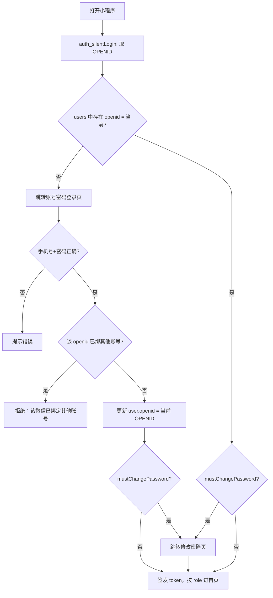

# 教培机构业绩助手 — 产品需求文档

> 版本：v0.4（MVP 聚焦版 · bind 已替换为 login）  
> 更新日期：2026-06-20  
> 原则：**先跑通前后端完整闭环，再迭代体验与高级功能**

---

## 文档导读

| 章节 | 阅读目的 |
|------|----------|
| [§2 MVP 目标](#2-mvp-目标首次交付) | 第一次上线要达成什么 |
| [§3 端到端演示场景](#3-端到端演示场景验收标准) | 验收时怎么走一遍 |
| [§4 MVP 功能范围](#4-mvp-功能范围) | 做什么、不做什么 |
| [§5 登录与账号体系](#5-登录与账号体系) | **核心**：静默登录 + 账号密码 |
| [§6～§8](#6-mvp-功能说明按页面) | 页面、数据模型、接口 |
| [§11 实施顺序](#11-mvp-实施顺序) | 建议开发步骤 |
| [附录 C](#附录-cbind--login-前端改造记录已完成) | bind → login 改造清单 |

---

## 1. 项目概述

### 1.1 产品定位

**教培机构业绩助手** 是一款面向教培机构的微信小程序：老板掌握机构业绩、管理员工；员工录入订单、查看个人业绩。

### 1.2 目标用户

| 角色 | 说明 |
|------|------|
| **老板（boss）** | 机构负责人，查看机构数据、创建员工 |
| **员工（staff）** | 销售/顾问，录入订单、查看个人数据 |

### 1.3 技术路线

| 阶段 | 前端 | 后端 |
|------|------|------|
| **MVP（当前）** | UniApp → 微信小程序 | 微信云开发（云函数 + 云数据库） |
| **后续** | 尽量不改 | 自建后台 + 管理端预置老板账号 |

### 1.4 当前进度

| 项 | 状态 |
|----|------|
| 小程序页面 UI 骨架 | ✅ 已完成 |
| 角色路由、底部导航 | ✅ 已完成 |
| 认证流程前端 + Mock | ✅ 已完成（`bind` 已移除，`login` 已上线） |
| 微信云开发接入 | ⬜ 代码已就绪，待配置环境 ID 并部署云函数 |
| 真实数据读写与统计 | ⬜ 代码已就绪，部署后联调 |

---

## 2. MVP 目标（首次交付）

### 2.1 一句话目标

> **让预置老板、一名新员工，在微信小程序里完成「账号登录 → 绑微信 → 改初始密码 → 录订单 → 双方看到真实业绩」的完整闭环。**

### 2.2 MVP 成功标准

- [ ] 云库中已预置老板账号（手机号 + 初始密码）
- [ ] 老板首次打开 → 静默失败 → 手机号密码登录 → 绑定 openid → 强制改密 → 进入老板端
- [ ] 老板能新增员工（姓名 + 手机号 + 初始密码 + 月目标）
- [ ] 员工首次打开 → 手机号密码登录 → 绑定 openid → 强制改密 → 进入员工端
- [ ] 员工能录入订单；老板 / 员工首页展示真实汇总数据
- [ ] 已绑定用户再次打开 → 静默登录直达，无需输密码
- [ ] 用户换微信后 → 静默失败 → 手机号密码登录 → 更新 openid 后可继续使用

### 2.3 MVP 刻意不做

| 功能 | 处理方式 |
|------|----------|
| ~~`pages/auth/bind` 手机号绑定页~~ | **已移除**，由 `pages/auth/login` 替代 |
| 首个 openid 自动当老板 | **已废弃**，老板云库预置 |
| 管理后台预置老板 | MVP 手动插库；v1.0 再做后台 |
| 员工头像上传 | 表单占位，不存储 |
| 员工编辑 / 离职 | 仅「新增 + 列表」 |
| 员工搜索 / 状态筛选 | UI 占位，全量列表 |
| 业绩目标页切换月份 | 固定当月 |
| 排行榜今日 / 本周 | 仅「本月」真实数据 |
| 环比、趋势图、课程饼图 | 延后或占位 |
| 订单编辑 / 作废 | 不做 |
| 机构名称 / 目标在线修改 | 预置数据写死即可 |
| 多机构 SaaS | 不做 |

---

## 3. 端到端演示场景（验收标准）

### 前置条件（开发 / 测试环境）

在云数据库手动插入：

1. `institutions`：1 条机构记录  
2. `users`：1 条老板记录（手机号 `13900000001`，初始密码 `Boss@123`，`role: boss`，`openid` 为空，`mustChangePassword: true`）

### 场景 A：老板首次使用

| 步骤 | 操作 | 预期 |
|:----:|------|------|
| 1 | 老板微信打开小程序 | 发起静默登录 |
| 2 | openid 未绑定 | 跳转 **账号密码登录页** |
| 3 | 输入 `13900000001` + 初始密码 | 登录成功，写入 openid |
| 4 | 系统检测需改密 | 跳转 **修改密码页**，改密成功后进老板端 |
| 5 | 查看首页 | 今日 / 本月业绩为 0 |
| 6 | 添加员工：李老师、`13800000002`、初始密码 `Staff@123`、月目标 `10000` | 保存成功，状态「待绑定」 |

### 场景 B：员工首次使用并录单

| 步骤 | 操作 | 预期 |
|:----:|------|------|
| 1 | 员工微信打开小程序 | 静默失败 → 账号密码登录页 |
| 2 | 输入 `13800000002` + `Staff@123` | 登录成功，绑定 openid |
| 3 | 强制改密 | 修改密码后进入员工端 |
| 4 | 新增订单：小明 / 少儿英语 / `1200` | 保存成功 |
| 5 | 员工首页 / 订单列表 | 今日 1200，列表有该订单 |

### 场景 C：老板看到汇总

| 步骤 | 操作 | 预期 |
|:----:|------|------|
| 1 | 老板刷新首页 | 今日 1200、本月 1200 |
| 2 | 销售排行（本月） | 李老师 1200，排名第 1 |

### 场景 D：再次打开（静默登录）

| 步骤 | 操作 | 预期 |
|:----:|------|------|
| 1 | 员工 / 老板关闭后重开 | openid 命中 → 静默登录 → 直达对应首页 |

### 场景 E：换微信登录

| 步骤 | 操作 | 预期 |
|:----:|------|------|
| 1 | 员工在新微信打开小程序 | 静默失败（新 openid 未绑定） |
| 2 | 手机号 + 密码登录 | 校验通过，**更新 openid 为新值** |
| 3 | 已改过密 | 无需再改密，直接进入员工端 |
| 4 | 旧微信再次打开 | 静默失败，需重新密码登录（或联系老板重置） |

---

## 4. MVP 功能范围

### 4.1 认证模块（老板 / 员工同一套规则）

| 功能 | MVP | 说明 |
|------|:---:|------|
| 微信静默登录 | ✅ | openid 已绑定则直接进系统 |
| 账号密码登录 | ✅ | 账号 = 手机号 + 密码 |
| 登录时绑定 / 更新 openid | ✅ | 密码登录成功后写入当前 openid |
| 首次登录强制改密 | ✅ | `mustChangePassword = true` 时跳转改密页 |
| 主动修改密码 | ✅ | 个人中心入口（改密页已有 UI） |
| 签发 token | ✅ | 静默 / 密码登录均发 token |
| 退出登录 | ✅ | 清 token，回入口页 |
| ~~手机号绑定页 `bind`~~ | ❌ | 已移除；见 `pages/auth/login` |
| 账号密码登录页 `login` | ✅ | 手机号 + 密码，登录时绑定 openid |

### 4.2 业务模块

| 模块 | MVP | 延后 |
|------|:---:|------|
| 老板首页业绩数字 | ✅ | 环比、趋势图 |
| 业绩目标（当月） | ✅ | 切换月份 |
| 销售排行（本月） | ✅ | 今日 / 本周 |
| 员工列表 + 新增（含初始密码） | ✅ | 搜索、编辑、离职 |
| 员工录单 + 订单列表 | ✅ | 筛选、作废 |
| 个人中心展示 + 改密 | ✅ | 头像 |

### 4.3 权限（MVP）

| 操作 | 老板 | 员工 |
|------|:----:|:----:|
| 查看机构业绩 / 排行 | ✅ | ❌ |
| 新增员工 | ✅ | ❌ |
| 录入订单 | ❌ | ✅ |
| 查看自己的订单 / 业绩 | ❌ | ✅ |
| 修改自己的密码 | ✅ | ✅ |

---

## 5. 登录与账号体系

### 5.1 账号来源

| 角色 | MVP 创建方式 |
|------|--------------|
| **老板** | 开发期在云数据库 **手动插入**；后期由管理后台预置 |
| **员工** | 老板在小程序「员工管理」中创建，含初始密码 |

**老板与员工使用完全相同的登录规则**，仅登录后按 `role` 跳转不同首页。

### 5.2 登录流程



### 5.3 业务规则

1. **登录账号** = 手机号 + 密码（机构内手机号唯一）。
2. **静默登录优先**：openid 已绑定且有效 → 直接进系统，无需密码。
3. **静默失败** → 展示账号密码登录（含：首次使用、换微信、openid 被清空等）。
4. **密码登录成功** → 将当前 openid 写入该用户（首次绑定或换微信重绑）。
5. **首次登录改密**：`mustChangePassword === true` 时，必须改密后才能进业务首页。
   - 老板创建员工时：`mustChangePassword: true`，初始密码由老板设定（或系统生成后告知员工）。
   - 老板预置数据：同样设 `mustChangePassword: true`。
6. **换微信**：新 openid 与库中不一致 → 只能密码登录 → 成功后 **覆盖** 旧 openid。
7. **openid 冲突**：若当前 openid 已绑定其他 user → 拒绝登录，提示联系老板。
8. 密码在库中 **只存哈希**，不存明文（云函数内 bcrypt 或等效方案）。

### 5.4 错误提示

| 场景 | 提示文案 |
|------|----------|
| 手机号或密码错误 | 手机号或密码错误 |
| 手机号不存在 | 账号不存在，请联系老板 |
| 当前微信已绑其他账号 | 该微信已绑定其他账号，请联系老板处理 |
| 新密码与确认不一致 | 两次输入的密码不一致 |
| 原密码错误（改密时） | 原密码错误 |

### 5.5 老板账号预置（MVP）

开发 / 测试时在云开发控制台或脚本插入示例：

```json
// institutions
{
  "name": "阳光教育",
  "monthlyTarget": 100000,
  "createdAt": "<serverDate>"
}

// users（老板）
{
  "institutionId": "<institutions._id>",
  "name": "机构老板",
  "phone": "13900000001",
  "role": "boss",
  "openid": "",
  "passwordHash": "<Boss@123 的哈希>",
  "mustChangePassword": true,
  "status": "pending_bind",
  "target": 0,
  "createdAt": "<serverDate>"
}
```

> **后期（v1.0）**：通过管理后台创建机构 + 老板账号，替代手动插库。

### 5.6 认证相关页面（当前路由）

| 页面路径 | 作用 | 状态 |
|----------|------|------|
| `pages/entrance/index` | 启动、静默登录 | ✅ 已实现 |
| `pages/auth/login` | 手机号 + 密码登录（**替代原 bind 页**） | ✅ 已实现 |
| `pages/modules/staff/user/password` | 首次改密 / 主动改密 | ✅ 前端 + Mock |
| ~~`pages/auth/bind`~~ | ~~仅输入手机号认领账号~~ | ❌ 已从 `pages.json` 移除 |

**迁移要点：**

- 入口页静默失败（`status: need_login`）→ `redirectToLogin()` → `/pages/auth/login`
- 原 `bindPhone` API 已删除，改为 `login({ phone, password })`
- 原 `pendingOpenid` 本地存储已删除，openid 绑定在密码登录成功时由 Mock / 云函数写入

---

## 6. MVP 功能说明（按页面）

### 6.1 入口页 `pages/entrance/index`

| 项 | 实现说明 |
|----|----------|
| 启动 | 调用 `wechatSilentLogin()`（对应云函数 `auth_silentLogin`） |
| `status === 'ok'` | `finishAuthFlow` → 按角色进首页 |
| `status === 'need_change_password'` | `setAuth` → `redirectToChangePassword(true)` |
| `status === 'need_login'` | `redirectToLogin()` → **`pages/auth/login`**（不再跳转 bind） |
| Mock 按钮 | 「模拟已绑定老板」「模拟需密码登录」 |

### 6.2 账号密码登录页 `pages/auth/login`

> 本页取代原 `pages/auth/bind`，用户须同时输入手机号与密码。

| 项 | 实现说明 |
|----|----------|
| 表单 | 手机号 + 密码 |
| 提交 | 调用 `login()`（对应云函数 `auth_login`） |
| 成功 | `finishAuthFlow`：按需改密或 `redirectByRole` |
| Mock 快捷填充 | 页面底部可点选老板 / 员工测试账号 |

### 6.3 修改密码页 `pages/modules/staff/user/password`

| 项 | MVP 要求 |
|----|----------|
| 首次改密 | 从登录流程跳入；原密码 = 刚使用的初始密码 |
| 主动改密 | 从个人中心跳入；需校验原密码 |
| 提交 | 调用 `auth_changePassword` |
| 成功 | `mustChangePassword` 置 false → 跳转对应角色首页 |

> 老板端若无独立改密页，可复用同一页面或抽成公共页 `pages/auth/change-password`。

### 6.4 老板首页 `pages/modules/boss/home/index`

| 数据字段 | 计算方式 |
|----------|----------|
| `todayAmount` | 本机构今日订单之和 |
| `monthAmount` | 本机构本月订单之和 |
| `monthTarget` | `institutions.monthlyTarget` |
| `monthProgress` | `monthAmount / monthTarget * 100` |

### 6.5 业绩目标 `pages/modules/boss/target/index`

| 数据字段 | 计算方式 |
|----------|----------|
| `monthAmount` / `monthTarget` / `completionRate` | 同 §6.4 |

### 6.6 销售排行 `pages/modules/boss/ranking/index`

| 项 | MVP 要求 |
|----|----------|
| 维度 | 仅「本月」 |
| 范围 | `status = active` 的员工 |
| 排序 | 本月业绩降序 |

### 6.7 员工管理 `pages/modules/boss/staff/*`

**新增员工字段：**

| 字段 | 必填 | 入库 |
|------|:----:|:----:|
| 姓名 | ✅ | ✅ |
| 手机号（登录账号） | ✅ | ✅ |
| 初始密码 | ✅ | ✅ 存哈希 |
| 月目标 | ✅ | ✅ |
| 头像 | — | ❌ |

创建时默认：`role: staff`，`openid: ""`，`status: pending_bind`，`mustChangePassword: true`。

**列表展示状态：**

| status | 展示 |
|--------|------|
| `pending_bind` | 待绑定（尚未微信登录过） |
| `active` | 在职（已绑定 openid） |

### 6.8 员工首页 / 订单

与 v0.2 相同：个人业绩汇总、录单（学员 / 课程 / 金额 / 备注）、订单列表倒序。

### 6.9 个人中心 `pages/modules/staff/user/index`

| 项 | MVP 要求 |
|----|----------|
| 展示姓名 / 角色 | 读 `getUser()` |
| 修改密码 | 跳转改密页，接 API |
| 退出登录 | `clearAuth` → 入口页 |

老板端若有「我的」页，同样提供改密与退出（MVP 可仅在员工端做，老板从设置入口进改密页）。

---

## 7. MVP 数据模型

### 7.1 `institutions`

```json
{
  "_id": "auto",
  "name": "阳光教育",
  "monthlyTarget": 100000,
  "createdAt": "serverDate"
}
```

### 7.2 `users`

```json
{
  "_id": "auto",
  "institutionId": "institutions._id",
  "name": "李老师",
  "phone": "13800000002",
  "role": "boss | staff",
  "openid": "",
  "passwordHash": "<bcrypt>",
  "mustChangePassword": true,
  "status": "pending_bind | active",
  "target": 10000,
  "createdAt": "serverDate"
}
```

| 字段 | 说明 |
|------|------|
| `phone` | 登录账号，机构内唯一 |
| `openid` | 微信绑定；空表示尚未在本机微信登录过 |
| `passwordHash` | 密码哈希，永不返回前端 |
| `mustChangePassword` | `true` 时下次登录必须改密 |
| `status` | `pending_bind`：未绑 openid；`active`：已绑且可用 |

### 7.3 `orders`

```json
{
  "_id": "auto",
  "institutionId": "institutions._id",
  "staffId": "users._id",
  "staffName": "李老师",
  "studentName": "小明",
  "courseName": "少儿英语",
  "amount": 1200,
  "remark": "",
  "createdAt": "serverDate"
}
```

**索引建议：**

- `users.openid`（稀疏唯一）
- `users.phone` + `users.institutionId`（唯一）
- `orders.institutionId` + `orders.createdAt`
- `orders.staffId` + `orders.createdAt`

---

## 8. MVP 接口 / 云函数清单

### 8.1 认证

**前端 `src/api/auth.js`（已落地）：**

| 前端方法 | 云函数（待接入） | 说明 |
|----------|------------------|------|
| `wechatSilentLogin()` | `auth_silentLogin` | 静默登录 |
| `login({ phone, password })` | `auth_login` | **替代原 `bindPhone`** |
| `changePassword({ oldPassword, newPassword })` | `auth_changePassword` | 修改密码 |

| 云函数 | 请求 | 响应 data |
|--------|------|-----------|
| `auth_silentLogin` | — | `{ status: 'ok', token, user }` / `{ status: 'need_login' }` / `{ status: 'need_change_password', token, user }` |
| `auth_login` | `{ phone, password }` | `{ token, user, mustChangePassword }` |
| `auth_changePassword` | `{ oldPassword, newPassword }` | `{ user }`（`mustChangePassword: false`） |

**`auth_login` 服务端逻辑摘要：**

1. 按 `phone` 查 user  
2. 校验 `passwordHash`  
3. 检查当前 OPENID 是否已被其他 user 占用  
4. 更新 `user.openid`、`status → active`  
5. 签发 token，返回 `mustChangePassword`

### 8.2 业务云函数

与 v0.2 相同：`boss_dashboard`、`boss_target`、`boss_ranking`、`staff_list`、`staff_create`、`staff_dashboard`、`order_list`、`order_create`。

**鉴权：** 除 `auth_silentLogin`、`auth_login` 外均校验 token；写操作核对 OPENID 与 token 用户一致。

### 8.3 统一响应格式

```json
{ "code": 0, "message": "ok", "data": {} }
```

| code | 含义 |
|------|------|
| 0 | 成功 |
| 401 | 未登录 / 密码错误 |
| 403 | 无权限 |
| 404 | 账号不存在 |
| 409 | 手机号重复、openid 冲突等 |

---

## 9. 非功能需求（MVP 最小集）

| 类别 | 要求 |
|------|------|
| 平台 | 微信小程序 |
| 安全 | 密码哈希存储；token + OPENID 双校验；登录失败不暴露具体是手机号还是密码错误（对外统一文案可配置） |
| 性能 | 汇总接口 < 3s（百级订单） |
| 可迁移 | 前端只调 `src/api/*` |

---

## 10. 页面与实现状态

| 模块 | 页面路径 | 前端 | Mock | 云函数 |
|------|----------|:----:|:----:|:------:|
| 入口 / 静默登录 | `pages/entrance/index` | ✅ | ✅ | ⬜ 待部署 |
| ~~手机号绑定~~ | ~~`pages/auth/bind`~~ | ❌ 已移除 | — | — |
| 账号密码登录 | `pages/auth/login` | ✅ | ✅ | ⬜ 待部署 |
| 修改密码 | `pages/modules/staff/user/password` | ✅ | ✅ | ⬜ 待部署 |
| 老板首页 | `pages/modules/boss/home/index` | ✅ | ✅ | ⬜ 待部署 |
| 业绩目标 | `pages/modules/boss/target/index` | ✅ | ✅ | ⬜ 待部署 |
| 销售排行 | `pages/modules/boss/ranking/index` | ✅ | ✅ | ⬜ 待部署 |
| 员工列表 / 新增 | `boss/staff/*` | ✅ | ✅ | ⬜ 待部署 |
| 员工首页 | `staff/home/index` | ✅ | ✅ | ⬜ 待部署 |
| 录单 / 订单列表 | `staff/order/*` | ✅ | ✅ | ⬜ 待部署 |
| 个人中心 | `staff/user/index` | ✅ | — | — |

---

## 11. MVP 实施顺序

```
Phase 1 云开发环境
  └─ 开通云开发、建 3 集合、手动插入机构 + 老板种子数据

Phase 2 认证闭环
  ├─ 前端：login 替代 bind、入口/改密页接 Mock     ✅ 已完成
  └─ 云函数：auth_silentLogin / auth_login / auth_changePassword   ⬜ 待做

Phase 3 员工管理
  └─ staff_create（含初始密码哈希）+ staff_list

Phase 4 订单
  └─ order_create + order_list

Phase 5 统计
  └─ boss_* / staff_dashboard

Phase 6 联调验收
  └─ 按 §3 场景 A～E 走一遍
```

---

## 12. 版本路线图

### v0.1 — MVP（当前）

- 静默登录 + 手机号密码登录 + 首次改密
- 老板种子数据 + 员工创建 + 录单 + 业绩汇总

### v0.2 — 体验完善

- 趋势图、排行多维度、员工编辑 / 搜索、订单作废等

### v1.0 — 平台化

- 管理后台预置老板（替代手动插库）
- 迁移自建后台、多机构 SaaS 等

---

## 附录 A：延后功能 Backlog

| 功能 | 建议版本 |
|------|----------|
| 管理后台预置老板 | v1.0 |
| 业绩趋势图、环比 | v0.2 |
| 排行今日 / 本周 | v0.2 |
| 员工编辑、离职、搜索 | v0.2 |
| 头像上传 | v0.2 |
| 订单编辑 / 作废 | v0.2 |
| 课程字典 | v0.2 |
| 多机构 SaaS | v1.0 |

---

## 附录 B：术语表

| 术语 | 说明 |
|------|------|
| 静默登录 | 用微信 OPENID 自动识别已绑定用户 |
| 账号密码登录 | 手机号 + 密码，用于首次绑定或换微信 |
| 待绑定 | 账号已创建但 `openid` 为空 |
| 强制改密 | `mustChangePassword` 为 true 时的改密流程 |

---

## 附录 C：bind → login 前端改造记录（已完成）

| 文件 | 改动 | 状态 |
|------|------|:----:|
| `pages/auth/bind.vue` | 删除；由 `login.vue` 接管 | ✅ |
| `pages/auth/login.vue` | 新建：手机号 + 密码登录 | ✅ |
| `pages.json` | 路由 `pages/auth/bind` → `pages/auth/login` | ✅ |
| `pages/entrance/index.vue` | `need_login` → login；`finishAuthFlow` | ✅ |
| `src/api/auth.js` | `login`、`changePassword`；移除 `bindPhone` | ✅ |
| `src/mock/auth.js` | `mockLogin` 替代 `mockBindPhone` | ✅ |
| `src/untils/auth.js` | 移除 `pendingOpenid`；新增 `finishAuthFlow` 等 | ✅ |
| `pages/modules/boss/staff/edit.vue` | 初始密码必填 | ✅ |
| `pages/modules/staff/user/password.vue` | 接 `changePassword`，支持 `?required=1` | ✅ |
| `pages/modules/staff/user/index.vue` | `getUser()`、退出回入口页 | ✅ |

### 本地 Mock 测试账号

| 角色 | 手机号 | 密码 | 说明 |
|------|--------|------|------|
| 老板 | `13900000001` | `Boss@123` | 已绑 `mock-openid-boss`，可测静默登录 |
| 员工 | `13800000002` | `Staff@123` | 未绑 openid，登录后强制改密 |

重置 Mock：清除 `edu_mock_accounts` 等本地缓存后重新编译。
